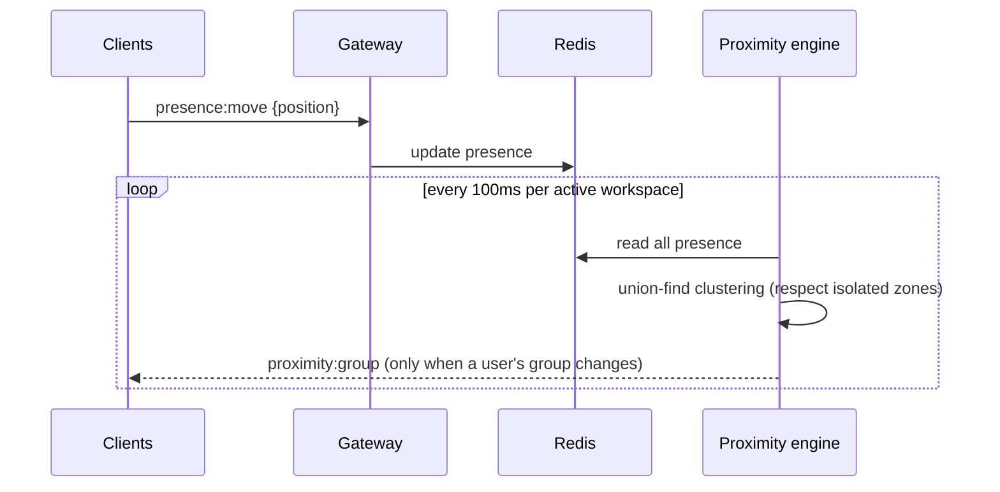
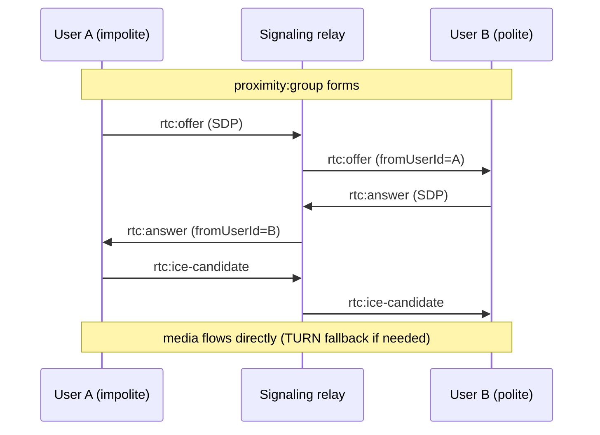

# Architecture

Vicinity is a spatial collaboration platform. Users appear as avatars on a 2D
floor; audio/video conversations form automatically based on **proximity** or
shared **zones**. This document explains how the pieces fit together.

## System overview

```mermaid
flowchart TB
    subgraph Client["apps/web — Next.js + React + TS"]
        Canvas[OfficeCanvas]
        Panels[Members / Chat / Controls]
        Mesh[MeshManager (WebRTC)]
        WS[Socket.IO client]
    end

    subgraph API["apps/api — Express + Socket.IO"]
        REST[REST controllers]
        Gateway[Presence gateway]
        Signal[Signaling relay]
        Prox[Proximity engine]
    end

    subgraph Data
        PG[(PostgreSQL + Prisma)]
        Redis[(Redis)]
        Blob[(Azure Blob / S3 — design-ready)]
    end

    Canvas & Panels --> WS
    WS <--> Gateway
    Mesh <-->|SDP/ICE| Signal
    Mesh <-.->|media P2P| Mesh
    REST --> PG
    Gateway <--> Redis
    Prox <--> Redis
    Signal <--> Redis
    REST --> Blob
```

## Components

| Component            | Location                         | Responsibility                                                 |
| -------------------- | -------------------------------- | -------------------------------------------------------------- |
| Web app              | `apps/web`                       | UI, 2D canvas, presence rendering, WebRTC client               |
| API service          | `apps/api`                       | REST, WebSocket gateway, signaling relay, proximity engine     |
| Shared contracts     | `packages/shared`                | Types, enums, WS event contract, spatial constants             |
| Design system        | `packages/ui`                    | Original, reusable UI primitives                               |
| Database             | PostgreSQL (via Prisma)          | Durable state: users, workspaces, zones, channels, messages    |
| Cache / presence     | Redis                            | Ephemeral position/status, Socket.IO adapter, rate limiting    |
| Object storage       | Azure Blob / S3 (design-ready)   | Avatars, uploads, future recordings                            |

## Data flow — presence & movement

1. Client authenticates the socket with its JWT (`auth.token`).
2. Client emits `presence:join { workspaceId }`. The gateway verifies membership,
   writes the initial `PresenceState` to Redis, and joins the workspace room.
3. Movement: the canvas integrates keyboard/click input each animation frame and
   emits `presence:move { position }` **throttled to 15 Hz**. The server updates
   Redis and broadcasts `presence:moved` to the workspace room only.
4. Position/status is **never persisted** — it lives in Redis with a safety TTL.

## Real-time flow — proximity



The proximity engine (`apps/api/src/realtime/proximity.ts`) is a **pure,
unit-tested** function: it groups users within `PROXIMITY_RADIUS` using
union-find, honoring audio-isolated zones. The engine wrapper
(`proximity.engine.ts`) ticks per active workspace and emits only deltas.

## WebRTC flow

- Media is **peer-to-peer mesh** for small groups (≤ `MESH_MAX_PARTICIPANTS`).
- The server is a **signaling relay only** — it forwards SDP offers/answers and
  ICE candidates between users' personal rooms and never sees media.
- The client (`MeshManager`) uses the **perfect-negotiation** pattern to handle
  glare and re-negotiation (adding camera/screen tracks mid-call).
- `fromUserId` is stamped **server-side**, so peers cannot spoof identity.



### Scaling media beyond mesh (future)

When a group exceeds `MESH_MAX_PARTICIPANTS`, the proximity engine marks the
group `mode: 'sfu'` with a `roomName`. The client should then request a
short-lived, room-scoped token from a `POST /media/token` endpoint and connect
to an SFU (LiveKit or mediasoup) instead of the mesh. This is stubbed today
(see `docs/ROADMAP.md`).

## Database model

See `prisma/schema.prisma`. Durable entities:

- `User`, `Workspace`, `Membership` (role per workspace)
- `Zone` (open/focus/meeting/lounge/private; optional audio isolation)
- `Invite`, `Channel` (workspace/zone/dm), `ChannelMember`, `Message`
- `Resource` (links/files/whiteboard per zone)

Ephemeral state (positions, live status, active media membership) lives in Redis.

## Scaling approach

- **API** is stateless → scale horizontally behind a load balancer.
- **WebSocket** nodes scale horizontally via the **Redis Socket.IO adapter**;
  use sticky sessions or a WS-aware load balancer.
- **Interest management**: position updates broadcast to the workspace room only.
  For very large floors, add spatial-hash grid rooms (future).
- **Redis** presence is sharded per workspace and disposable.
- **PostgreSQL**: add read replicas for history/analytics; partition `messages`
  by time as volume grows.
- **Regionalize** realtime + SFU near users; route by workspace region.

## Security boundaries

- Browser ↔ API: JWT bearer on REST; JWT handshake on WebSocket.
- Every workspace/zone mutation passes a **membership + role guard** server-side.
- Media tokens (future SFU) are minted server-side, room-scoped, short-lived.
- Secrets never reach the client bundle; see `docs/SECURITY.md`.
