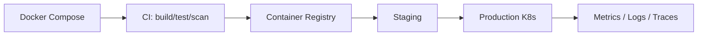

# Deployment

## Environments

| Environment | Purpose                        | Infra                              |
| ----------- | ------------------------------ | ---------------------------------- |
| Local       | Development                    | Docker Compose (Postgres + Redis)  |
| Staging     | Pre-production verification    | Containers on your cloud           |
| Production  | Live traffic                   | Kubernetes / managed services      |

## Local (Docker Compose)

```bash
cp .env.example .env
npm install
npm run docker:up          # starts Postgres + Redis
npm run prisma:migrate     # apply schema
npm run prisma:seed        # demo data
npm run dev                # web (3000) + api (4000)
```

`docker-compose.yml` provisions Postgres 16 and Redis 7 with health checks and
named volumes. The web and API run natively for fast iteration; container images
for both live under `infra/` for parity.

## Container images

- `infra/Dockerfile.api` — multi-stage build → runs the compiled Express server.
- `infra/Dockerfile.web` — Next.js standalone output.

Build:

```bash
docker build -f infra/Dockerfile.api -t vicinity-api .
docker build -f infra/Dockerfile.web -t vicinity-web .
```

## Cloud deployment (design)



- **Frontend**: Vercel or a containerized Next.js service.
- **API + realtime**: horizontally scaled pods behind a WS-aware load balancer.
  Scale API by CPU; scale realtime by connection count. Use the **Redis adapter**
  so Socket.IO events fan out across pods.
- **Migrations**: run `prisma migrate deploy` as a pre-deploy job/init container.

## Azure-ready mapping

| Concern        | Azure service                          |
| -------------- | -------------------------------------- |
| Compute        | Azure Kubernetes Service (AKS) or Container Apps |
| PostgreSQL     | Azure Database for PostgreSQL Flexible Server    |
| Redis          | Azure Cache for Redis                  |
| Object storage | Azure Blob Storage                     |
| Secrets        | Azure Key Vault                        |
| Identity       | Microsoft Entra ID (`AUTH_MODE=entra`) |
| Observability  | Azure Monitor / Application Insights (OTLP) |
| Media relay    | TURN (coturn) or managed SFU (LiveKit) |

## Environment variables

See `.env.example` for the authoritative list. Key groups:

- **API**: `API_PORT`, `CORS_ORIGINS`
- **Database**: `DATABASE_URL`
- **Redis**: `REDIS_URL`
- **Auth**: `JWT_SECRET`, `JWT_ACCESS_TTL`, `JWT_REFRESH_TTL`, `AUTH_MODE`,
  `ENTRA_*`
- **WebRTC**: `STUN_URLS`, `TURN_URL`, `TURN_USERNAME`, `TURN_CREDENTIAL`
- **Frontend**: `NEXT_PUBLIC_API_URL`, `NEXT_PUBLIC_WS_URL`
- **Observability**: `LOG_LEVEL`, `OTEL_EXPORTER_OTLP_ENDPOINT`

## Health & readiness

- `GET /healthz` — liveness probe.
- `GET /readyz` — readiness probe; returns `503` until Postgres and Redis are
  reachable. Wire both into your orchestrator probes.

## Scaling checklist

- [ ] Multiple API/WS replicas with Redis adapter
- [ ] Sticky sessions or WS-aware LB
- [ ] Managed Postgres with backups + read replica
- [ ] Managed Redis (cluster mode if needed)
- [ ] TURN servers provisioned; SFU for large rooms
- [ ] Autoscaling policies (CPU for API, connections for WS)
- [ ] Centralized logs, metrics, and traces
