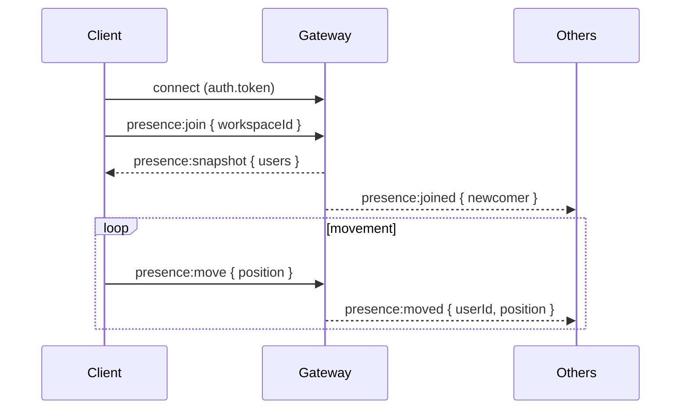
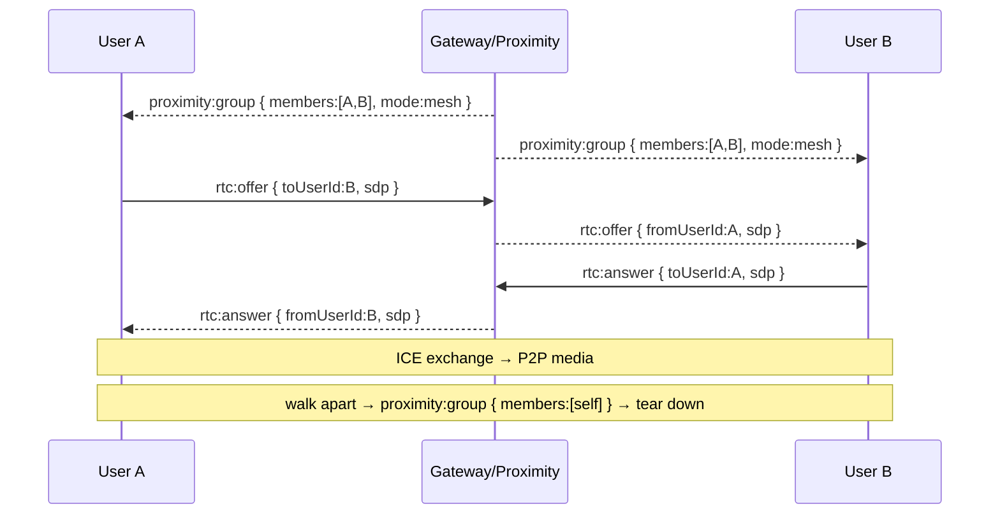

# WebSocket Events

Transport: **Socket.IO** at the same origin as the API. The full contract is
typed in `packages/shared/src/ws-events.ts` and shared by client and server.

## Connection & auth

The client provides its access token in the handshake:

```ts
io(wsUrl, { auth: { token: accessToken }, transports: ['websocket'] });
```

The server verifies the JWT and loads the user before any event is processed.
Unauthenticated sockets are rejected with `UNAUTHORIZED`.

## Client → Server

| Event                     | Payload                                | Notes                                   |
| ------------------------- | -------------------------------------- | --------------------------------------- |
| `presence:join`           | `{ workspaceId }`                       | Membership verified server-side          |
| `presence:move`           | `{ position: { x, y } }`                | Throttled to ~15 Hz on the client        |
| `presence:status`         | `{ status }`                            | `available`/`busy`/`in-meeting`/`away`   |
| `zone:enter`              | `{ zoneId }`                            | Updates presence zone                    |
| `zone:leave`              | `{}`                                    | Clears presence zone                     |
| `chat:subscribe`          | `{ channelId }`                         | Access-checked; joins channel room       |
| `chat:send`               | `{ channelId, body }`                   | Persists + broadcasts                    |
| `rtc:offer`               | `{ toUserId, sdp }`                     | Relayed to `toUserId`                    |
| `rtc:answer`              | `{ toUserId, sdp }`                     | Relayed to `toUserId`                    |
| `rtc:ice-candidate`       | `{ toUserId, candidate }`               | Relayed to `toUserId`                    |
| `rtc:call-start`          | `{ toUserId }`                          | Control signal                           |
| `rtc:call-end`            | `{ toUserId }`                          | Control signal                           |
| `rtc:screen-share-start`  | `{ groupId }`                           | Broadcast to peers                       |
| `rtc:screen-share-stop`   | `{ groupId }`                           | Broadcast to peers                       |

## Server → Client

| Event                     | Payload                                             |
| ------------------------- | --------------------------------------------------- |
| `presence:snapshot`       | `{ users: PresenceState[] }` (sent on join)         |
| `presence:joined`         | `PresenceState`                                     |
| `presence:moved`          | `{ userId, position }`                              |
| `presence:status`         | `{ userId, status }`                                |
| `presence:left`           | `{ userId }`                                        |
| `proximity:group`         | `{ groupId, members[], mode, roomName? }`           |
| `proximity:update`        | `{ groupId, members[] }`                            |
| `zone:updated`            | `{ zone }`                                          |
| `chat:message`            | `{ channelId, message }`                            |
| `rtc:offer`               | `{ fromUserId, toUserId, sdp }`                     |
| `rtc:answer`              | `{ fromUserId, toUserId, sdp }`                     |
| `rtc:ice-candidate`       | `{ fromUserId, toUserId, candidate }`               |
| `rtc:call-start`          | `{ fromUserId }`                                    |
| `rtc:call-end`            | `{ fromUserId }`                                    |
| `rtc:screen-share-start`  | `{ fromUserId, groupId }`                           |
| `rtc:screen-share-stop`   | `{ fromUserId, groupId }`                           |
| `error`                   | `{ code, message }`                                 |

> `fromUserId` on all `rtc:*` events is set by the **server** from the socket's
> authenticated identity — clients cannot forge it.

## Sequence — joining a floor



## Sequence — proximity conversation + media


